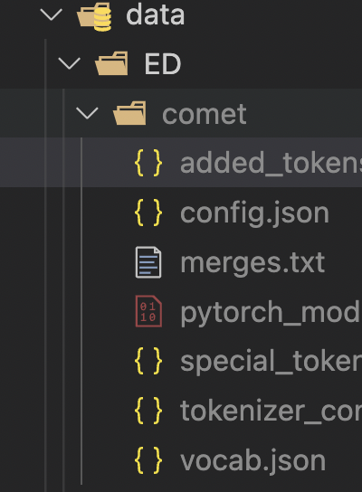
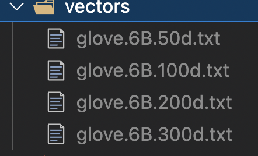

## pretrain cmdline

---

1. :blush: init
    - `mkdir best_model predicts`
    
    - `mkdir ./data/ED/comet` 
   
    - download [comet checkpoint](https://github.com/allenai/comet-atomic-2020) to **comet** directory.  

    
    - `wget http://nlp.stanford.edu/data/glove.6B.zip` to `./vectors` .  

2. :fire: code params explanation
   
| params        | instruction   |  
| --------   | -----:  |
| model    | model type available contains **trans,mult,empdg,mime,moel,kemp,cem,emf** |  
| code_check        |   **store_strue** for fast check program runnable in ur machine  |  
|devices | value passed to `os['CUDA_VISIBLE_DEVICE']` |
|mode| **train_only,train_and_test,test_only** indicates run partial or whole process| 
|max_epoch|max epochs to train model|
|emotion_emb_type|**origin,coarse,contrastive** indicates different emotion embedings,details see paper|
| batch_size       |    batch size for train,valid,test    | 

3. :dog: run experiment
   
4. :mag_right: todo list
   - [ ] run all models
   - [ ] add more params to control
   - [ ] run on other datasets